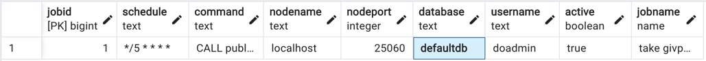

# Impact Graph

---

### Build status

- Develop - [](https://github.com/Giveth/impact-graph/actions/workflows/develop-pipeline.yml)
- Staging - [](https://github.com/Giveth/impact-graph/actions/workflows/staging-pipeline.yml)
- Production - [](https://github.com/Giveth/impact-graph/actions/workflows/master-pipeline.yml)

---
ImpactQL is a GraphQL server, that enables rapid development of serverless impact project applications. It does this by taking care of the persistance of impact project data.

[Installation](#installation)

[Features](#features)

[Architecture](#architecture)

[Vision](#place-2)

[here](#place-2)

## Installation

```
git clone git@github.com:topiahq/impact-graph.git
cd impact-graph

// we specified version in .nvmrc file, so when you just enter nvm use it will use exact version of required npm
nvm use

// You should have installed chromium on your system, it can be installed by your or package maneger (apt,brew, ..)
npm i
// If you had problem on npm install, you can see https://stackoverflow.com/a/66044814/9372962 (Mac os users)
cp config/example.env config/development.env
```

Edit the config/development.env file in your favorite code editor and the environmental variables

[Create a database](https://medium.com/coding-blocks/creating-user-database-and-adding-access-on-postgresql-8bfcd2f4a91e) (we recommend Postgres) on your computer or server, we currently support for MySQL, MariaDB, Postgres, MongoDB and SQLite.
Or if you want, you can run the docker-compose like this:
`docker-compose -f docker-compose-local.yml --profile database up -d`
and put these to your `development.env`

```
TYPEORM_DATABASE_TYPE=postgres
TYPEORM_DATABASE_NAME=qacc
TYPEORM_DATABASE_USER=postgres
TYPEORM_DATABASE_PASSWORD=postgres
TYPEORM_DATABASE_HOST=localhost
TYPEORM_DATABASE_PORT=5442
```

## RUN

```
npm start
```

## Log

In localhost and test we put logs in console and file but in production and staging we just use file for writing logs
You can see logs beautifully with this command

```
 npm i -g bunyan
 tail -f logs/impact-graph.log |bunyan

```

### Authentication

### Start fast

We enable impact projects to use our installation securely and privately for free, reach out for more details

### Own your own data

If this is more important you and your have the resources, deploy your own version of this

- An open source solution that enables you to keep control of your data
- Supports Bring Your Own Database (BYOD) and can be used with any database
- Built-in support for MySQL, MariaDB, Postgres, MongoDB and SQLite
- Works great with databases from popular hosting providers

## Architecture

The aim is to give a single entry point into any persistance solution that you want to use for your data.
The aim is for something like this:


We have so far only implemented these databases - MySQL, MariaDB, Postgres, MongoDB and SQLite

## Roadmap

The first use case we are building is user registration and putting projects in the database

## Authentication

### Strategies

There are many strategies available for authentication

#### OAuth

- Designed to work with any OAuth service, it supports OAuth 1.0, 1.0A and 2.0
- Built-in support for many popular OAuth sign-in services

#### Supports both JSON Web Tokens (JWT)

- Supports both JSON Web Tokens

### Example queries

If you want to see examples you can read test cases or see [Graphql queries](./test/graphqlQueries.ts)

### Admin panel

We use [AdminJS](https://github.com/SoftwareBrothers/adminjs) for Admin dashboard
You should navigate to `/admin` for browsing admin panel.
in your local database you can hash a desired password with `BCRYPT_SALT` that is in your `config/development.env` with
[bcrypt](https://github.com/kelektiv/node.bcrypt.js) then you set that value in `encryptedPassword` of your user in DB and
change `role` of user to `admin` in db
Now you can login in admin dashboard with your user's `email` and the `password` you already set

We wrote a migration file to create an admin user in local DB to can test it easily,
so after executing migrations and run application you can navigate to http://localhost:4000/admin and login
with this data

- admin role: \*`username`: **test-admin@giveth.io**, `password`: **admin**
- campaignManager role: \*`username`: **campaignManager@giveth.io**, `password`: **admin**
- reviewer role: \*`username`: **reviewer@giveth.io**, `password`: **admin**
- operator role: \*`username`: **operator@giveth.io**, `password`: **admin**

**PS**:
A simple script for create encryptedPassword

```
const bcrypt = require('bcrypt');

bcrypt.hash(
  'yourPassword',
  Number('yourSalt'),
).then(hash => {console.log('hash',hash)}).catch(e=>{console.log("error", e)});

```

Add admin user to DB query

```
INSERT INTO public.user (email, "walletAddress", role,"loginType", name,"encryptedPassword") VALUES
('test@giveth.io', 'walletAddress', 'admin','wallet', 'test', 'aboveHash')
```

### Logging:

Default loggin is done by [Apollo Graph Manager](https://www.apollographql.com/docs/graph-manager/)
To make use of it you need to use register and provide a key in APOLLO_KEY in your .env file.

### Changes to the database

Dropping and seeding the database can be done like this during testing:

```
DROP_DATABASE=true
SEED_DATABASE=true
```

After a site is live or if you want to keep your database you need to use database migrations.

This can be done either by creating a new migration file with:

#### Create new Migration file

```
npx typeorm-ts-node-commonjs migration:create ./migration/create_organization_tokens_token_table

```

#### Run migrations

```
npm run db:migrate:run:local
```

#### Revert migrations

If you want to revert last migration :

```
npm run db:migrate:revert:local
```

### TEST

For running tests you need to register infura and etherscan api-key, and you should pass this environment variables

`PINATA_API_KEY=0000000000000 PINATA_SECRET_API_KEY=00000000000000000000000000000000000000000000000000000000  ETHERSCAN_API_KEY=0000000000000000000000000000000000 XDAI_NODE_HTTP_URL=https://xxxxxx.xdai.quiknode.pro INFURA_API_KEY=0000000000000000000000000000000000 npm run test`

### PRE_COMMITS

Please before committing your changes run
`npm run prettify` to fix eslint and prettify warnings

You will need to add the above command to your build process so that all database migrations are run upon deployments.

### Statuses

You can generate table with this site
https://www.tablesgenerator.com/markdown_tables

| id  | symbol        | name          | description                                                                          | Who can change to       |
| --- | ------------- | ------------- | ------------------------------------------------------------------------------------ | ----------------------- |
| 1   | rejected      | rejected      | his project has been rejected by Giveth or platform owner, We dont use it now        |                         |
| 2   | pending       | pending       | This project is created, but pending approval, We dont use it now                    |                         |
| 3   | clarification | clarification | Clarification requested by Giveth or platform owner, We dont use it now              |                         |
| 4   | verification  | verification  | Verification in progress (including KYC or otherwise), We dont use it now            |                         |
| 5   | activated     | activated     | This is an active project                                                            | project owner and admin |
| 6   | deactivated   | deactivated   | Deactivated with user or Giveth Admin                                                | project owner and admin |
| 7   | cancelled     | cancelled     | Cancelled by Giveth Admin                                                            | admin                   |
| 8   | drafted       | drafted       | This project is created as a draft for a potential new project, but can be discarded | project owner           |

**PS**

- If a project is **cancelled** just admin can activate that
- If project is **deactive** both admins and project owner can activate it
- Both admins and project owner can deactivate an **active** project

### Diagrams

If you want to edit the mermaid diagrams, just replace https://mermaid.ink/img/ with https://mermaid-js.github.io/mermaid-live-editor/edit#
in below image links

#### Donation Flow

[![](https://mermaid.ink/img/eyJjb2RlIjoic2VxdWVuY2VEaWFncmFtXG4gICAgYXV0b251bWJlclxuICAgIGFjdG9yIFVzZXJcbiAgICBwYXJ0aWNpcGFudCBGcm9udGVuZFxuICAgIHBhcnRpY2lwYW50IE1ldGFtYXNrXG4gICAgcGFydGljaXBhbnQgQmFja2VuZFxuICAgIHBhcnRpY2lwYW50IERCXG4gICAgcGFydGljaXBhbnQgTW9ub3N3YXBcblxuICAgIFVzZXIgLT4-IEZyb250ZW5kOiBXYW50IHRvIGRvbmF0ZVxuICAgIG5vdGUgb3ZlciBGcm9udGVuZDogQ2hlY2sgcHJvamVjdCB3YWxsZXQgYWRkcmVzc1xuXG4gICAgRnJvbnRlbmQgLT4-IE1ldGFtYXNrIDogQ3JlYXRlIHRyYW5zYWN0aW9uXG4gICAgTWV0YW1hc2sgLS0-PiBVc2VyOiBTaG93IGNvbmZpcm0gdHJhbnNhY3Rpb24gcG9wdXBcbiAgICBVc2VyIC0-PiBNZXRhbWFzazogT2tcbiAgICBNZXRhbWFzayAtPj4gRnJvbnRlbmQgOiBGcm9udGVuZCBnZXQgdHhIYXNoIGJ5IHdlYjNcbiAgICBGcm9udGVuZCAtPj4gQmFja2VuZDogU2F2ZSBuZXcgZG9uYXRpb25cbiAgICBub3RlIG92ZXIgQmFja2VuZDogVmFsaWRhdGUgZG9uYXRpb24ncyBpbmZvIHdpdGggcHJvamVjdCB3YWxsZXQgYWRkcmVzcywgdXNlciwgLi5cbiAgICBCYWNrZW5kIC0-PiBEQjogU2F2ZSBkb25hdGlvbiB0byBEQlxuICAgIERCIC0tPj4gQmFja2VuZCA6IE9rXG4gICAgQmFja2VuZCAtPj4gTW9ub3N3YXAgOiBHZXQgcHJpY2Ugb2YgZG9uYXRlZCB0b2tlblxuICAgIGFsdCBNb25vc3dhcCBjYW4gZmV0Y2ggcHJpY2U6XG4gICAgICAgIE1vbm9zd2FwIC0tPj4gQmFja2VuZCA6IHJldHVybiBwcmljZVxuICAgICAgICBCYWNrZW5kIC0-PiBEQjogVXBkYXRlIHByaWNlVXNkIGFuZCB2YWx1ZVVzZCBvZiBkb25hdGlvblxuICAgICAgICBEQiAtLT4-IEJhY2tlbmQ6IE9rXG4gICAgICAgIEJhY2tlbmQgLT4-IERCOiBVcGRhdGUgcHJvamVjdCB0b3RhbERvbmF0aW9ucyB2YWx1ZVVzZFxuICAgICAgICBEQiAtLT4-IEJhY2tlbmQ6IE9rXG4gICAgZWxzZSBSZXR1cm4gZXJyb3I6XG4gICAgICAgIE1vbm9zd2FwIC0tPj4gQmFja2VuZCA6IFJldHVybiBFcnJvclxuICAgICAgICBub3RlIG92ZXIgQmFja2VuZDogRG8gbm90aGluZ1xuICAgIGVuZFxuICAgIEJhY2tlbmQgLS0-PiBGcm9udGVuZDogT2tcbiIsIm1lcm1haWQiOnsidGhlbWUiOiJkZWZhdWx0In0sInVwZGF0ZUVkaXRvciI6dHJ1ZSwiYXV0b1N5bmMiOnRydWUsInVwZGF0ZURpYWdyYW0iOmZhbHNlfQ)](https://mermaid-js.github.io/mermaid-live-editor/edit/#eyJjb2RlIjoic2VxdWVuY2VEaWFncmFtXG4gICAgYXV0b251bWJlclxuICAgIGFjdG9yIFVzZXJcbiAgICBwYXJ0aWNpcGFudCBGcm9udGVuZFxuICAgIHBhcnRpY2lwYW50IE1ldGFtYXNrXG4gICAgcGFydGljaXBhbnQgQmFja2VuZFxuICAgIHBhcnRpY2lwYW50IERCXG4gICAgcGFydGljaXBhbnQgTW9ub3N3YXBcblxuICAgIFVzZXIgLT4-IEZyb250ZW5kOiBXYW50IHRvIGRvbmF0ZVxuICAgIG5vdGUgb3ZlciBGcm9udGVuZDogQ2hlY2sgcHJvamVjdCB3YWxsZXQgYWRkcmVzc1xuXG4gICAgRnJvbnRlbmQgLT4-IE1ldGFtYXNrIDogQ3JlYXRlIHRyYW5zYWN0aW9uXG4gICAgTWV0YW1hc2sgLS0-PiBVc2VyOiBTaG93IGNvbmZpcm0gdHJhbnNhY3Rpb24gcG9wdXBcbiAgICBVc2VyIC0-PiBNZXRhbWFzazogT2tcbiAgICBNZXRhbWFzayAtPj4gRnJvbnRlbmQgOiBGcm9udGVuZCBnZXQgdHhIYXNoIGJ5IHdlYjNcbiAgICBGcm9udGVuZCAtPj4gQmFja2VuZDogU2F2ZSBuZXcgZG9uYXRpb25cbiAgICBub3RlIG92ZXIgQmFja2VuZDogVmFsaWRhdGUgZG9uYXRpb24ncyBpbmZvIHdpdGggcHJvamVjdCB3YWxsZXQgYWRkcmVzcywgdXNlciwgLi5cbiAgICBCYWNrZW5kIC0-PiBEQjogU2F2ZSBkb25hdGlvbiB0byBEQlxuICAgIERCIC0tPj4gQmFja2VuZCA6IE9rXG4gICAgQmFja2VuZCAtPj4gTW9ub3N3YXAgOiBHZXQgcHJpY2Ugb2YgZG9uYXRlZCB0b2tlblxuICAgIGFsdCBNb25vc3dhcCBjYW4gZmV0Y2ggcHJpY2U6XG4gICAgICAgIE1vbm9zd2FwIC0tPj4gQmFja2VuZCA6IHJldHVybiBwcmljZVxuICAgICAgICBCYWNrZW5kIC0-PiBEQjogVXBkYXRlIHByaWNlVXNkIGFuZCB2YWx1ZVVzZCBvZiBkb25hdGlvblxuICAgICAgICBEQiAtLT4-IEJhY2tlbmQ6IE9rXG4gICAgICAgIEJhY2tlbmQgLT4-IERCOiBVcGRhdGUgcHJvamVjdCB0b3RhbERvbmF0aW9ucyB2YWx1ZVVzZFxuICAgICAgICBEQiAtLT4-IEJhY2tlbmQ6IE9rXG4gICAgZWxzZSBSZXR1cm4gZXJyb3I6XG4gICAgICAgIE1vbm9zd2FwIC0tPj4gQmFja2VuZCA6IFJldHVybiBFcnJvclxuICAgICAgICBub3RlIG92ZXIgQmFja2VuZDogRG8gbm90aGluZ1xuICAgIGVuZFxuICAgIEJhY2tlbmQgLS0-PiBGcm9udGVuZDogT2tcbiIsIm1lcm1haWQiOiJ7XG4gIFwidGhlbWVcIjogXCJkZWZhdWx0XCJcbn0iLCJ1cGRhdGVFZGl0b3IiOnRydWUsImF1dG9TeW5jIjp0cnVlLCJ1cGRhdGVEaWFncmFtIjpmYWxzZX0)

#### Verify social network accounts ( for project verification flow)

[](https://mermaid-js.github.io/mermaid-live-editor/edit#pako:eNrFVcFu2zAM_RXCl7VAmgA9-hCga9euQJcNS7tTgEGVaEeNLXkSnSwo-u-jJDtJ03TYgA7zyYbI98j3aOoxk1Zhlmcef7RoJF5oUTpRzwzwIyRZB3ceXfpuhCMtdSMMwaWzhtColyfvhVwcPJhOQHiYWqlFBROklXULCGEzk4J7TDgZj3uYHM5FVYFQaoKrlPvF2UJXCHVLgrQ1cOQ5UJsSfDzvoQUjNc4-oKRv6HShZQy_tK6-VseJ0lhCsEt0W74pEmjTtARKkOBXcKi0j3AlGnSCUwSQ4wQmPWcBX8X6JEIItK6C-zXISqOhazWIiI7ruuODAQyHw4TQ5cFJEKBXI4evDql1JsAcEGo64YgOD1o2C8h2SoDppVDKofcpm32IBMHYHM78YpPlUCiQ1rCeFPutbKk7c0I0bAhvwsFLom5uKoIL7aV13RT0rLu2vih55Hfd9SPJvt9z9EglKFhpmvNMSm7kO1lGCd7w2Lo1eHKs85ZsI-R4HKq9Yktj_doUNjiRUG4DyPMK90pMsveZKXQz26HNK2vLCt-iyzIiDVKX4a_8o-6iGdPwEVOYoORe_6q9neDouVZJ3W3mgcG-wFRiFwtHoOmdh4cVHXc_Smr5OgheOFsDzdHhjoJbDW-0WbBM5i1UrDqs_6bjvnb7HHGbzYkan49GotHDvuKhtPVoeTqq8TdUYdG9Oo8HbLqKu6y3IO2xKMzu9oqG0dzZFeBPiU3cqbpIjjIoLEWlX-c4560RN-IyLllU8MyciO6wCjGagrIHdjIUvJS3E_H57O7242naPuDbKOxhSbdLsuh3YtmuPfi5bSt-10tkvbi4IHNg4UZZg6Z1jfW4J-AefSG4fPWPebNBVqOrhVZ8Cz_G2zDjX4WnIMv5VWEh2opm2cw8cWjb8J2EH5TmiznLC1F5HGSiJTtdG5nl5Frsg7qbvIt6-gW6nqHe)

###### Cron Job Creation

Cron job creation for test environment is already implemented in dbCronRepository.ts and a modified docker with enabled `pg_cron` extension.
Giveth uses digitalocean database in production and staging environment and setting snapshot cron job is done manually there because of the digital ocean restriction on configuring `pg_cron` extension.
Creating snapshot cronjob on digital ocean postgres database step:

1. Connect to database by `doadmin` user (database owner).
2. Create cron job by sql command

```sql
CREATE EXTENSION IF NOT EXISTS PG_CRON;
SELECT CRON.schedule(
    'take givpower boosting snapshot - develop',
    '*/5 * * * *',
    $$CALL public."TAKE_POWER_BOOSTING_SNAPSHOT"()$$);
```

The first parameter is the job name which must be **unique per environment**. Otherwise, it will override another existing job with the same name.

The cronjob expression above `*/5 * * * *` is for getting snapshot every 5 minutes in the test env. It can be a different schedule based on requirements.

3. Find created job id by running

```sql
SELECT * FROM cron.job
ORDER BY jobid DESC
```

 4. Alter the job (found its id above, supposed here 1) database to whatever is set for impact-graph, here `deveop`.

```sql
select cron.alter_job(job_id:=1,database:='develop');
```

For archiving old givpower snapshots data we must follow the same structure above, except in the 2nd step we must this command instead

```postgresql
CREATE EXTENSION IF NOT EXISTS PG_CRON;
SELECT CRON.schedule(
    '"archive givpower snapshots - develop"',
    '*/5 * * * *',
    $$CALL public."ARCHIVE_POWER_BOOSTING_OLD_SNAPSHOT_DATA"()$$);
```
