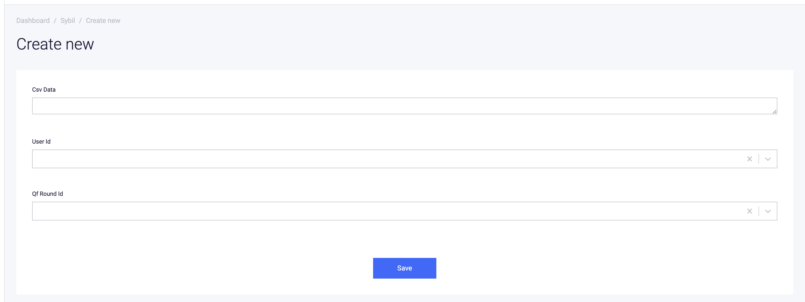
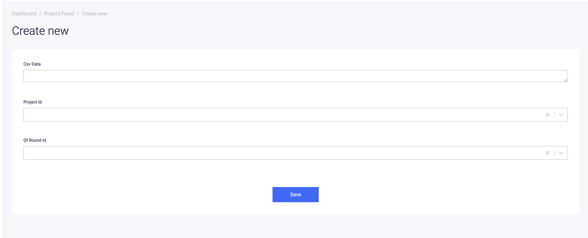

# Qf Round
## Create


* **Name** name of round that we show in the UI
* **Is Active** If we want qfRound be active we should check this option. **Be careful we can just have one active qfRound, otherwise system would not work well in this state**
* **Allocated Fund** The amount of fund that we want to distribute in this round ( USD value)
* **Minimum Passport Score** At the end of the round we just consider donations whose donor passport score is greater than or equal to this field
* **Begin Date** Exact time of when we want to begin round
* **End Date** Exact time of when round supposed to end **be careful of this field, because when end date passes admins can not edit round anymore**


# List


Admins can see list of QF Rounds here

# Show Single QF Round


You can see qf round detail and related projects of a qf round in this page

# Add projects to an active QF round
## Project list


You can select multiple project and add/remove them to existing active QF Round with these two buttons
**Add To Qf Round** and **Remove From Qf Round**

## Project page


You can add/remove a project to existing active QF Round with these two buttons
**Add Project To Qf Round** and **Remove Project From Qf Round**

And also you can see related qfRound of a project in this page


## Mark users as sybil for qfRound

### Add single item
If you want to just add a single item , you just choose a user from drop down menu and use a qfRound as well, leave the
**Csv Data** blank then click on Save button, this user will be marked as sybil for that round

### Add bulk
If you want to add multiple item at once, leave the **User Id** and **Qf Round Id** blank and just put a
csv content in the **Csv Data** text box, the csv data format should be like this

```
qfRoundId, walletAddress
1, 0x...
2, 0...
```


## Mark projects as fraud for qfRound

### Add single item
If you want to just add a single item , you just choose a project from drop down menu and use a qfRound as well, leave the
**Csv Data** blank then click on Save button, this project will be marked as fraud for that round

### Add bulk
If you want to add multiple item at once, leave the **Project Id** and **Qf Round Id** blank and just put a
csv content in the **Csv Data** text box, the csv data format should be like this



```
qfRoundId, slug
1, test
1, giveth
2, common-stack
```


